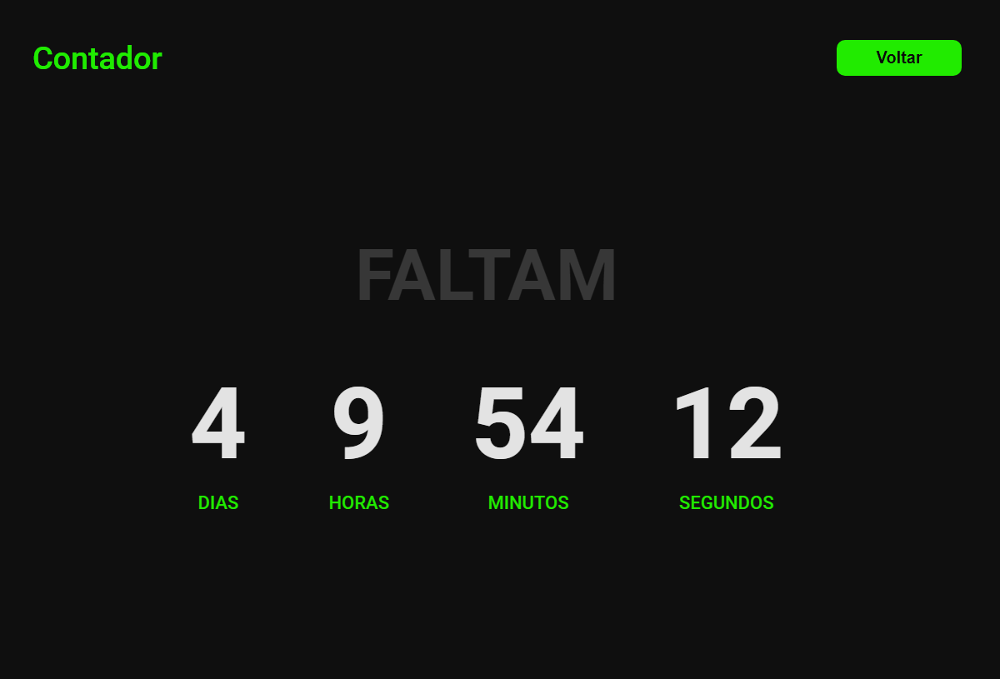

<h3>🔖Desafio contador</h3>

Seu desafio é criar um contador (com dias, horas, minutos e segundos), a partir de uma data definida pelo usuário!

<h3>🚀 Tecnologias</h3>
<ul>
    <li>Html</li>
    <li>Css</li>
    <li>Javascript</li>
</ul>

 
<h3 align="center"><a href="https://devchallenge.now.sh/challenges/5ed6d70709347b1dbf411b37/details" target="_blank">Link do Desafio</a></h3>
 

<h3>🖼 Layout</h3>

  <kbd>
    <video width="250" style="border-radius: 5px" height="450" src="./public/images/contador.mp4" alt="Intro">
  </kbd>
  &nbsp;&nbsp;&nbsp;&nbsp;

Feito por <a href='https://github.com/ElizabetePluGgui' target='blank'>Elizabete de Sousa Fabri 💜💜💜</a>

